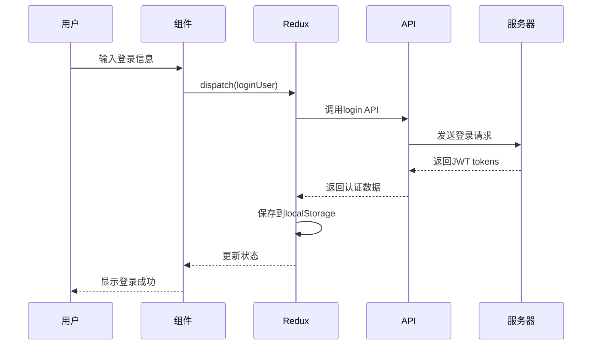
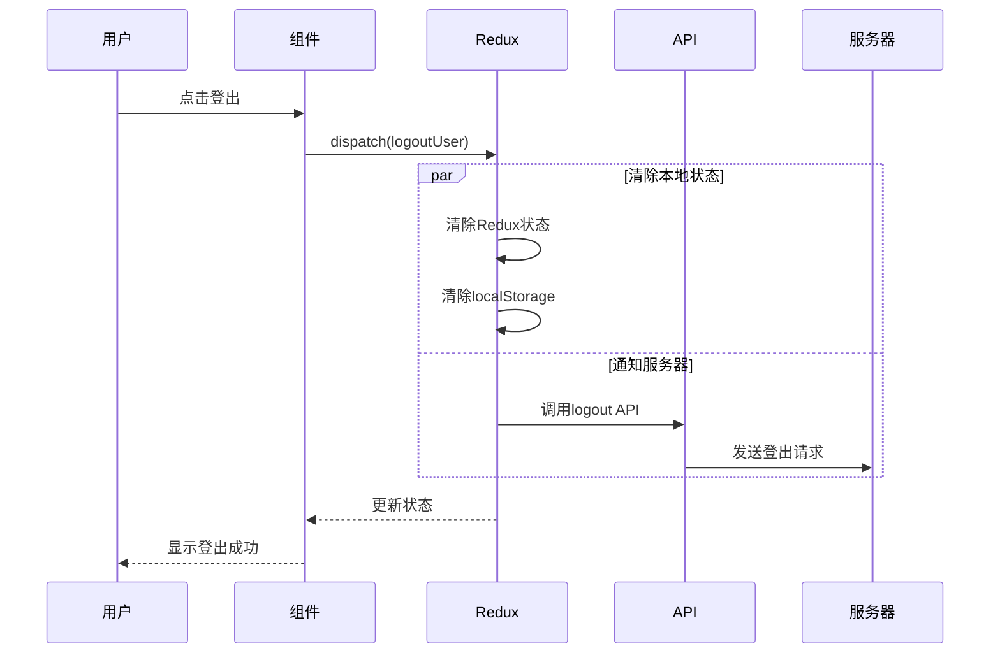
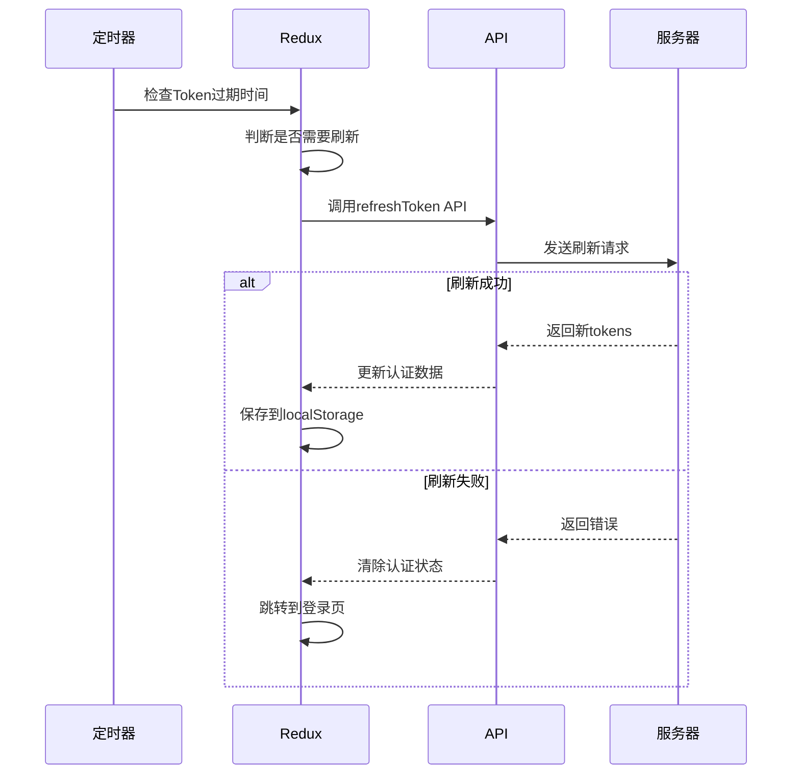

# 认证系统实现总结

## 🎯 项目概述

本项目实现了一套完整的JWT认证系统，包括登录、登出、Token刷新等功能，使用Redux Toolkit进行状态管理，支持自动Token刷新和持久化存储。

## 📁 文件结构

```
src/
├── store/
│   ├── slices/
│   │   └── authSlice.ts              # 认证状态管理核心
│   ├── middleware/
│   │   └── authMiddleware.ts         # Token自动刷新中间件
│   ├── hooks.ts                      # 类型安全的Redux hooks
│   └── index.ts                      # Store配置
├── apis/
│   └── auth.ts                       # 认证API接口
├── components/
│   ├── LoginModal/
│   │   └── LoginModal.tsx            # 登录模态框组件
│   ├── LogoutButton.tsx              # 登出按钮组件
│   └── AuthDemo.tsx                  # 认证系统演示组件
└── docs/
    ├── LOGIN_FLOW_DESIGN.md          # 登录流程设计文档
    └── AUTHENTICATION_SUMMARY.md     # 本文档
```

## 🔧 核心功能

### 1. 认证状态管理 (authSlice.ts)

**状态结构：**

```typescript
interface AuthState {
  isAuthenticated: boolean; // 是否已认证
  isLoading: boolean; // 是否正在加载
  error: string | null; // 错误信息
  accessToken: string | null; // 访问令牌
  refreshToken: string | null; // 刷新令牌
  tokenExpiry: number | null; // Token过期时间戳
}
```

**异步操作：**

- `loginUser()` - 用户登录
- `logoutUser()` - 用户登出
- `refreshTokenUser()` - 刷新Token

**同步操作：**

- `clearError()` - 清除错误
- `logout()` - 手动登出（不调用API）
- `setTokens()` - 手动设置tokens
- `checkTokenExpiry()` - 检查Token过期

### 2. API接口 (auth.ts)

**接口列表：**

- `getCaptcha()` - 获取验证码
- `login()` - 用户登录
- `logout()` - 用户登出
- `refreshToken()` - 刷新Token
- `validateToken()` - 验证Token有效性

**请求格式：**

- 登录使用FormData格式
- 登出和刷新使用JSON格式
- 所有接口都有完整的错误处理

### 3. 组件系统

**LoginModal组件：**

- 完整的登录表单
- 验证码集成
- 记住我功能
- 表单验证和错误处理

**LogoutButton组件：**

- 可配置的登出按钮
- 支持确认对话框
- 多种样式和尺寸
- 成功/失败回调

**AuthDemo组件：**

- 完整的认证系统演示
- 实时状态显示
- Token信息展示
- 操作面板

## 🔄 交互流程

### 登录流程



### 登出流程



### Token刷新流程



## 🛡️ 安全特性

### Token管理

- **双Token机制**：AccessToken(15分钟) + RefreshToken(7天)
- **自动刷新**：提前5分钟自动刷新Token
- **安全存储**：localStorage持久化存储
- **过期处理**：Token过期自动清除状态

### 数据保护

- **HTTPS传输**：所有API调用使用HTTPS
- **输入验证**：前端表单验证 + 后端验证
- **错误处理**：完整的错误处理和用户提示
- **状态清理**：登出时彻底清除敏感数据

### 防护措施

- **验证码**：防止机器人攻击
- **记住我**：可选的用户名记忆功能
- **重试机制**：Token刷新失败自动重试
- **降级处理**：API失败时的优雅降级

## 📊 状态管理

### Redux Store结构

```typescript
{
  auth: {
    isAuthenticated: boolean,
    isLoading: boolean,
    error: string | null,
    accessToken: string | null,
    refreshToken: string | null,
    tokenExpiry: number | null
  }
}
```

### 选择器函数

```typescript
// 基础选择器
selectAuth(); // 整个auth状态
selectIsAuthenticated(); // 是否已认证
selectIsLoading(); // 是否正在加载
selectAuthError(); // 错误信息
selectAccessToken(); // 访问令牌
selectRefreshToken(); // 刷新令牌
selectTokenExpiry(); // Token过期时间

// 高级选择器
selectShouldRefreshToken(); // 是否需要刷新Token
selectTokenRemainingTime(); // Token剩余时间(分钟)
```

## 🔧 使用方法

### 1. 基础使用

```tsx
import { useAppDispatch, useAppSelector } from '@/store/hooks';
import { loginUser, selectIsAuthenticated } from '@/store/slices/authSlice';

function MyComponent() {
  const dispatch = useAppDispatch();
  const isAuthenticated = useAppSelector(selectIsAuthenticated);

  const handleLogin = async () => {
    const result = await dispatch(
      loginUser({
        username: 'admin',
        password: '123456',
        captchaKey: 'key',
        captchaCode: '1234',
        rememberMe: true
      })
    );
  };

  return (
    <div>
      {isAuthenticated ? '已登录' : '未登录'}
      <button onClick={handleLogin}>登录</button>
    </div>
  );
}
```

### 2. 组件使用

```tsx
import LoginModal from '@/components/LoginModal/LoginModal';
import LogoutButton from '@/components/LogoutButton';

function App() {
  return (
    <div>
      <LoginModal />
      <LogoutButton variant='danger' showConfirm={true} onLogoutSuccess={() => console.log('登出成功')} />
    </div>
  );
}
```

### 3. 路由保护

```tsx
import { useAppSelector } from '@/store/hooks';
import { selectIsAuthenticated } from '@/store/slices/authSlice';

function ProtectedRoute({ children }) {
  const isAuthenticated = useAppSelector(selectIsAuthenticated);

  if (!isAuthenticated) {
    return <LoginPage />;
  }

  return children;
}
```

## 🚀 部署配置

### 环境变量

```env
# API配置
NEXT_PUBLIC_API_BASE_URL=https://api.example.com
NEXT_PUBLIC_AUTH_ENDPOINT=/api/v1/auth

# Token配置
NEXT_PUBLIC_ACCESS_TOKEN_EXPIRY=900    # 15分钟
NEXT_PUBLIC_REFRESH_TOKEN_EXPIRY=604800 # 7天

# 功能开关
NEXT_PUBLIC_ENABLE_REMEMBER_ME=true
NEXT_PUBLIC_ENABLE_AUTO_REFRESH=true
```

### 中间件配置

```typescript
// 在store中添加认证中间件
import { authMiddleware } from './middleware/authMiddleware';

export const store = configureStore({
  reducer: { auth: authReducer },
  middleware: (getDefaultMiddleware) => getDefaultMiddleware().concat(authMiddleware.middleware)
});
```

## 🧪 测试策略

### 单元测试

- Redux actions和reducers测试
- API函数测试
- 工具函数测试
- 组件渲染测试

### 集成测试

- 登录流程测试
- 登出流程测试
- Token刷新测试
- 错误处理测试

### E2E测试

- 完整用户登录流程
- 会话管理测试
- 跨页面状态保持
- 错误场景测试

## 📈 性能优化

### 状态优化

- 使用选择器避免不必要的重渲染
- 合理的状态结构设计
- 懒加载和代码分割

### 网络优化

- 请求去重和缓存
- Token预刷新机制
- 错误重试策略

### 用户体验

- 加载状态显示
- 错误信息提示
- 操作反馈

## 🔍 监控和日志

### 关键指标

- 登录成功率
- Token刷新频率
- 错误发生率
- 用户会话时长

### 日志记录

- 用户操作日志
- API调用日志
- 错误日志
- 性能日志

## 🛠️ 故障排除

### 常见问题

1. **Token过期问题**

   - 检查系统时间
   - 验证Token有效期设置
   - 确认刷新机制正常

2. **登录失败**

   - 检查API接口状态
   - 验证用户凭据
   - 查看网络连接

3. **状态不同步**
   - 检查localStorage
   - 验证Redux状态
   - 确认组件订阅

### 调试工具

- Redux DevTools
- 浏览器开发者工具
- 网络请求监控
- 控制台日志

## 📝 更新日志

### v1.0.0 (当前版本)

- ✅ 完整的JWT认证系统
- ✅ 登录/登出功能
- ✅ Token自动刷新
- ✅ 状态持久化
- ✅ 组件库支持
- ✅ TypeScript支持
- ✅ 错误处理机制

### 计划功能

- 🔄 Token自动刷新中间件
- 🔄 多设备登录管理
- 🔄 密码强度检查
- 🔄 二次验证支持
- 🔄 社交登录集成

## 🤝 贡献指南

1. Fork项目
2. 创建功能分支
3. 提交更改
4. 推送到分支
5. 创建Pull Request

## 📄 许可证

MIT License - 详见LICENSE文件

---

**注意：** 这是一个完整的认证系统实现，包含了生产环境所需的大部分功能。在实际部署时，请根据具体需求进行调整和优化。
