# 登录登出交互逻辑设计

## 概述

本文档详细描述了系统的登录、登出交互逻辑，包括JWT认证机制、接口调用流程和状态管理。

## 1. 整体架构

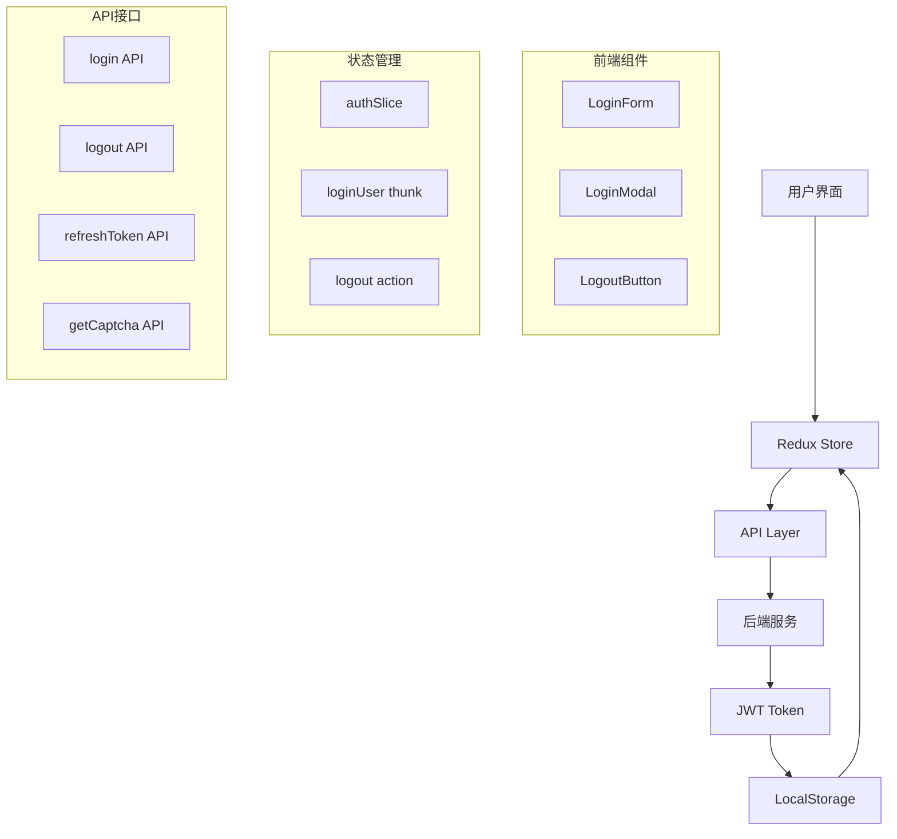

## 2. 登录流程

### 2.1 登录交互流程图

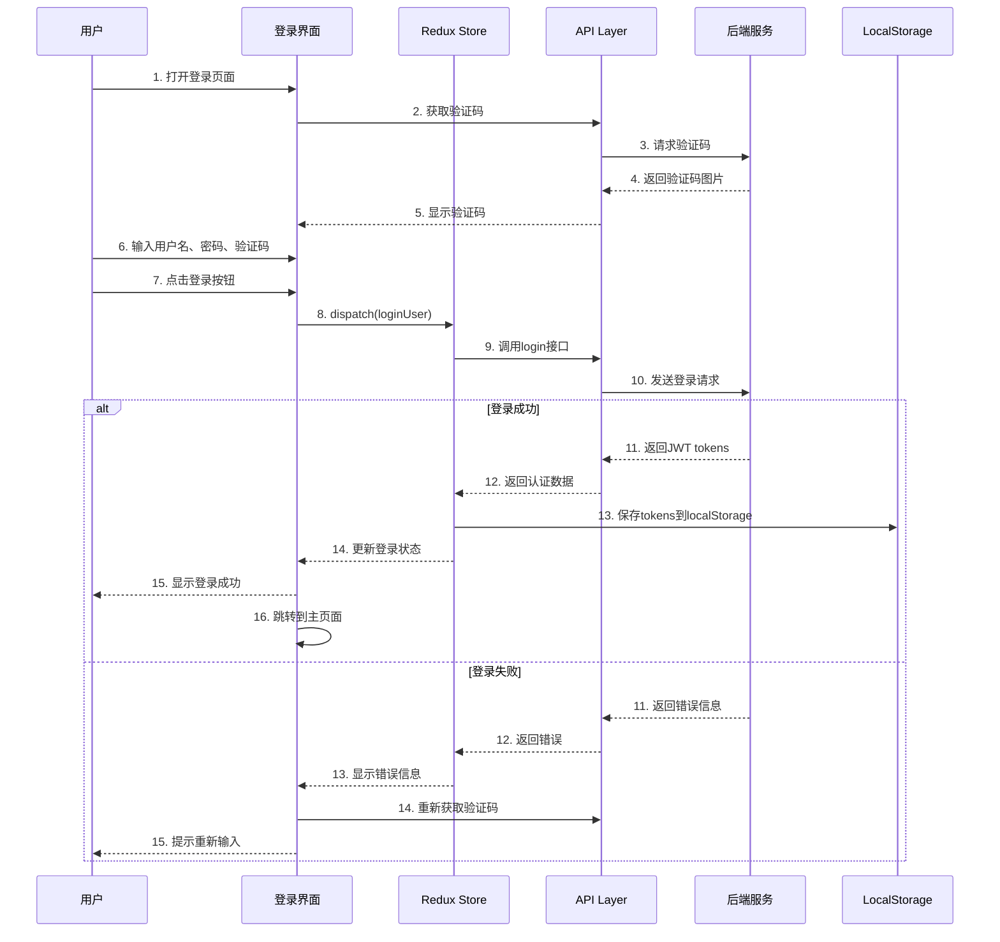

### 2.2 登录状态流转

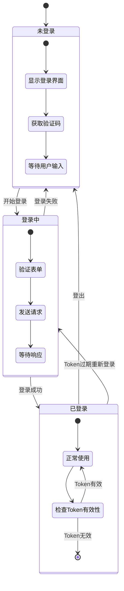

## 3. 登出流程

### 3.1 登出交互流程图

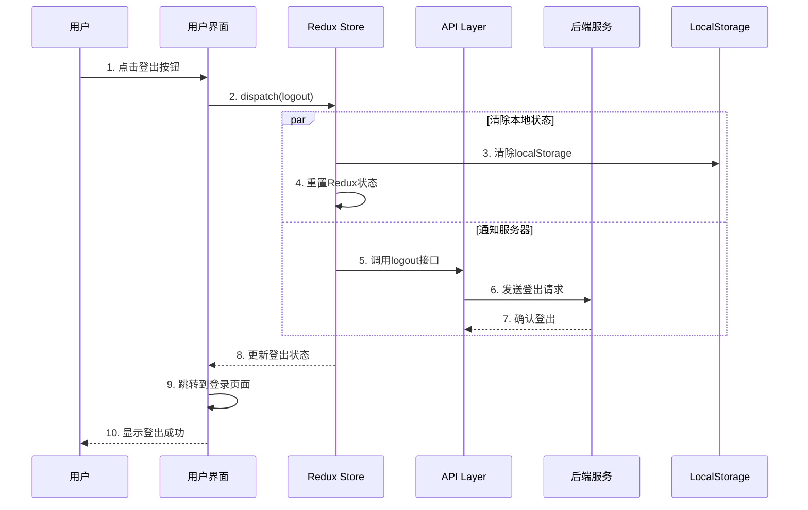

## 4. JWT Token管理

### 4.1 Token刷新流程

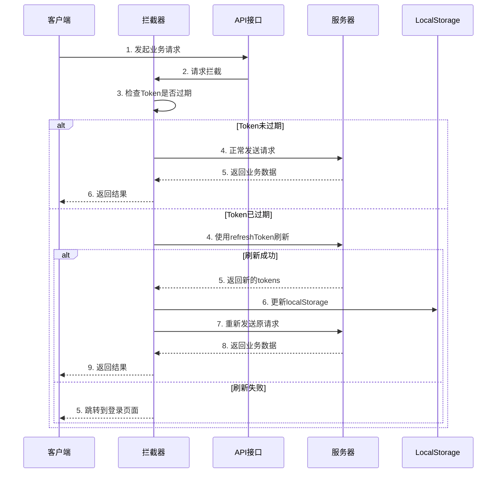

### 4.2 Token存储策略

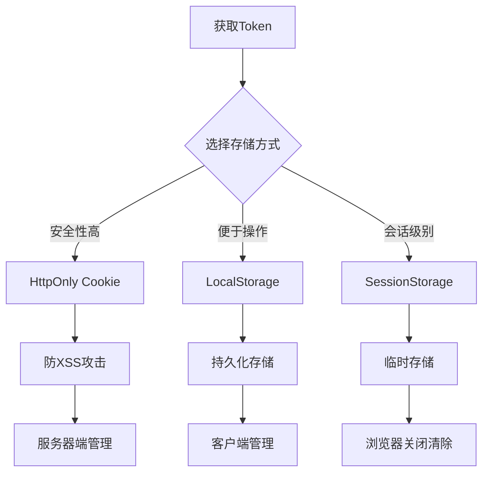

## 5. 接口设计

### 5.1 登录接口

```typescript
// 登录请求
interface LoginRequest {
  username: string; // 用户名
  password: string; // 密码
  captchaKey: string; // 验证码key
  captchaCode: string; // 验证码
  rememberMe: boolean; // 记住我
}

// 登录响应
interface LoginResponse {
  code: string;
  data: {
    accessToken: string; // 访问令牌 (15分钟)
    refreshToken: string; // 刷新令牌 (7天)
    expiresIn: number; // 过期时间(秒)
  };
  msg: string;
}
```

### 5.2 登出接口

```typescript
// 登出请求
interface LogoutRequest {
  refreshToken: string; // 刷新令牌
}

// 登出响应
interface LogoutResponse {
  code: string;
  msg: string;
}
```

### 5.3 Token刷新接口

```typescript
// 刷新Token请求
interface RefreshTokenRequest {
  refreshToken: string; // 刷新令牌
}

// 刷新Token响应
interface RefreshTokenResponse {
  code: string;
  data: {
    accessToken: string; // 新的访问令牌
    refreshToken: string; // 新的刷新令牌
    expiresIn: number; // 过期时间
  };
  msg: string;
}
```

## 6. Redux状态管理

### 6.1 AuthSlice状态结构

```typescript
interface AuthState {
  isAuthenticated: boolean; // 是否已认证
  isLoading: boolean; // 是否正在加载
  error: string | null; // 错误信息
  accessToken: string | null; // 访问令牌
  refreshToken: string | null; // 刷新令牌
  tokenExpiry: number | null; // Token过期时间戳
}
```

### 6.2 状态流转图

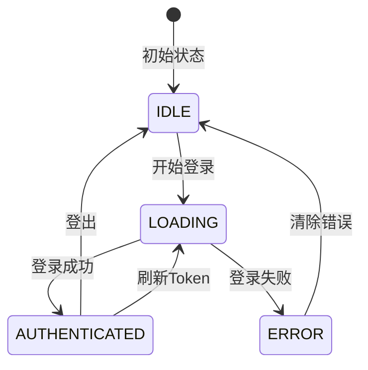

## 7. 错误处理

### 7.1 错误类型分类

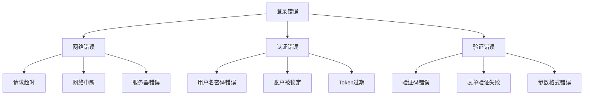

### 7.2 错误处理流程

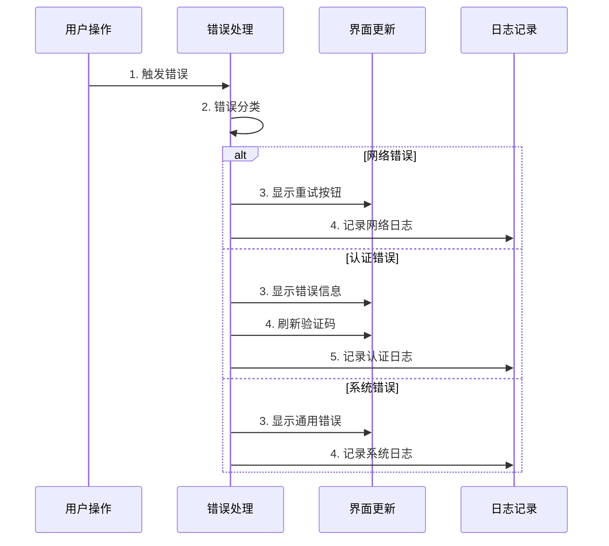

## 8. 安全考虑

### 8.1 安全措施

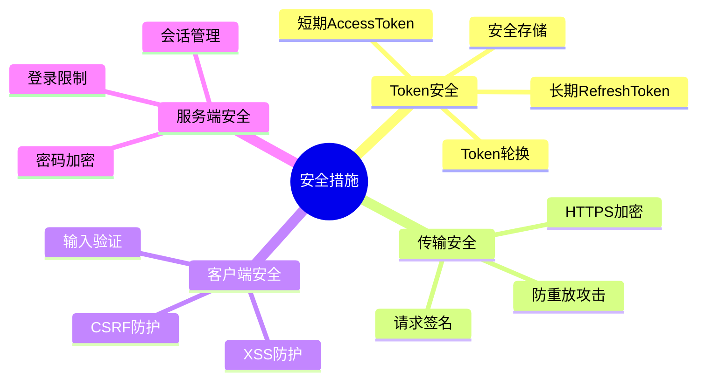

### 8.2 安全检查清单

- [ ] 使用HTTPS传输
- [ ] Token有效期设置合理
- [ ] 实现Token自动刷新
- [ ] 防止XSS攻击
- [ ] 防止CSRF攻击
- [ ] 输入数据验证
- [ ] 密码强度检查
- [ ] 登录失败次数限制
- [ ] 验证码防机器人
- [ ] 敏感操作二次验证

## 9. 性能优化

### 9.1 优化策略

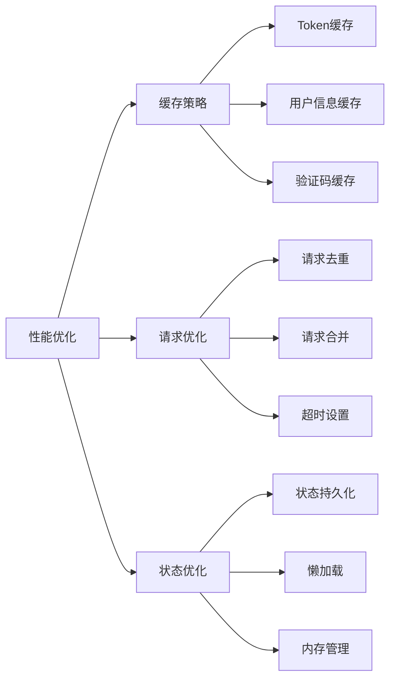

## 10. 测试策略

### 10.1 测试用例

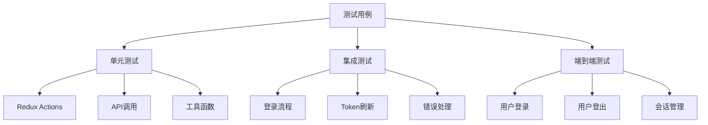

## 11. 监控和日志

### 11.1 监控指标

- 登录成功率
- 登录响应时间
- Token刷新频率
- 错误发生率
- 用户会话时长

### 11.2 日志记录

```typescript
// 日志记录示例
interface LoginLog {
  timestamp: string;
  userId?: string;
  action: 'LOGIN' | 'LOGOUT' | 'REFRESH_TOKEN';
  status: 'SUCCESS' | 'FAILURE';
  errorCode?: string;
  userAgent: string;
  ip: string;
}
```

## 12. 部署和配置

### 12.1 环境配置

```typescript
// 环境配置
interface AuthConfig {
  apiBaseUrl: string;
  tokenExpiry: number;
  refreshTokenExpiry: number;
  maxRetryAttempts: number;
  enableRememberMe: boolean;
  enableAutoRefresh: boolean;
}
```

这个设计文档涵盖了完整的登录登出交互逻辑，包括JWT认证、状态管理、错误处理、安全考虑等各个方面。你可以根据实际需求调整和完善这些流程。
